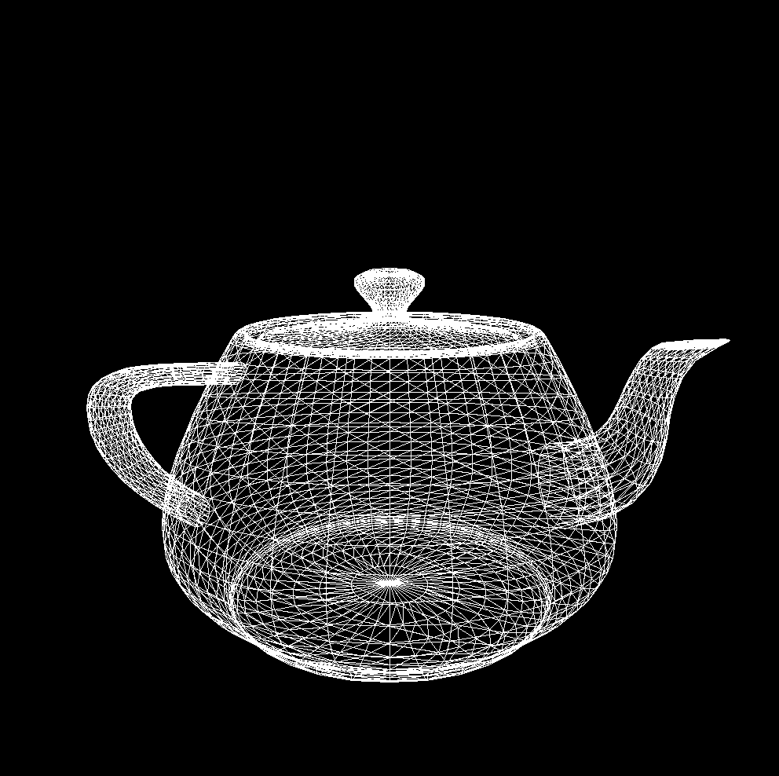

# Software Rasteriser + (hacky) OBJ Parser in Rust
A rewrite of my software rasteriser in C. Attempted to learn Rust while I was at it - with a heavy
emphasis on *attempt*... it was fun though!

## Screenshots

